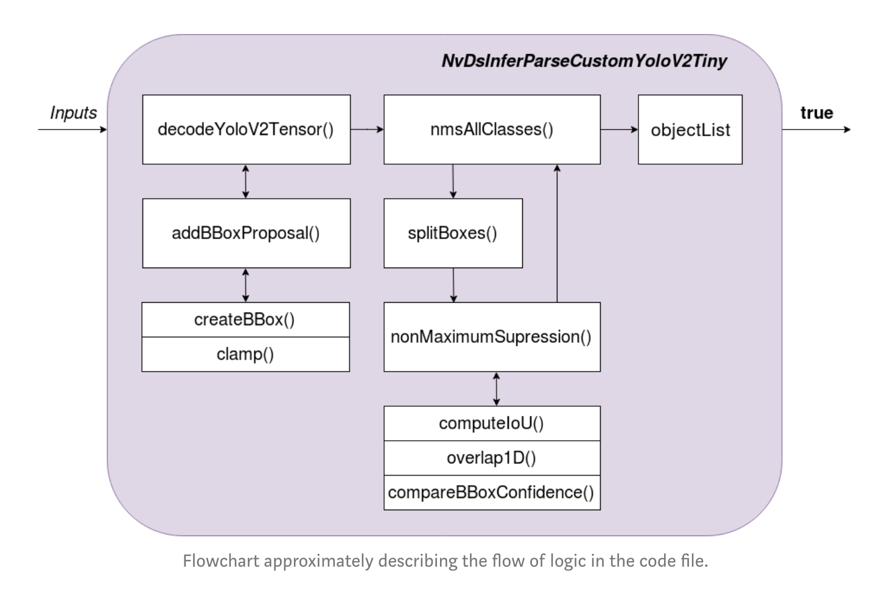

# zeabus_yolo

This is an implementation of YoloV3 with Deepstream.

Deepstream have many plug-ins and APIs which handle every task end-to-end. Details can be found here: https://docs.nvidia.com/metropolis/deepstream/4.0/dev-guide/DeepStream_Development_Guide/baggage/modules.html

Basics configuration can be done through `deepstream_app_config_yoloV3.txt`

## Integrating Yolo model into Deepstream

To use a Yolo model, Deepstream `nvdsinfer` will convert a model (consists of `.weights` and `yolov3.cfg`[case sensitive]) into TensorRT engine. This can be specified in `config_infer_primary_yoloV3.txt`.  On execution, if the engine is not detected, Deepstream will automatically build an engine from weights and cfg, then saved it to the main directory which can be used next time.

## Bounding Box Parser

Nvdsinfer (inferencing API) will output the result of Yolo model as it (1-D array). Predictions and bounding boxes would need to be extract explicitly. https://towardsdatascience.com/how-to-deploy-onnx-models-on-nvidia-jetson-nano-using-deepstream-b2872b99a031

The scripts can be found in `/nvdsinfer_custom_impl_Yolo/nvdsparsebbox_Yolo.cpp`

## Running Deepstream App

### For nvidia Jetson
* Clone this repository into `/opt/nvidia/deepstream/deepstream4.0/sources`
1. Compile nvsdinfer in `/nvdsinfer_custom_impl_Yolo` using `$ make -C custom_bbox_parser `
2. Specify source, output, and labels in `deepstream_app_config_yoloV3.txt` (OSD – on screen display and others display setting can also be configure here)
3. Specify .weights and .cfg's path in `config_infer_primary_yoloV3.txt`
4. Running Deepstream with `$ deepstream-app -c deepstream_app_config_yoloV3.txt`

